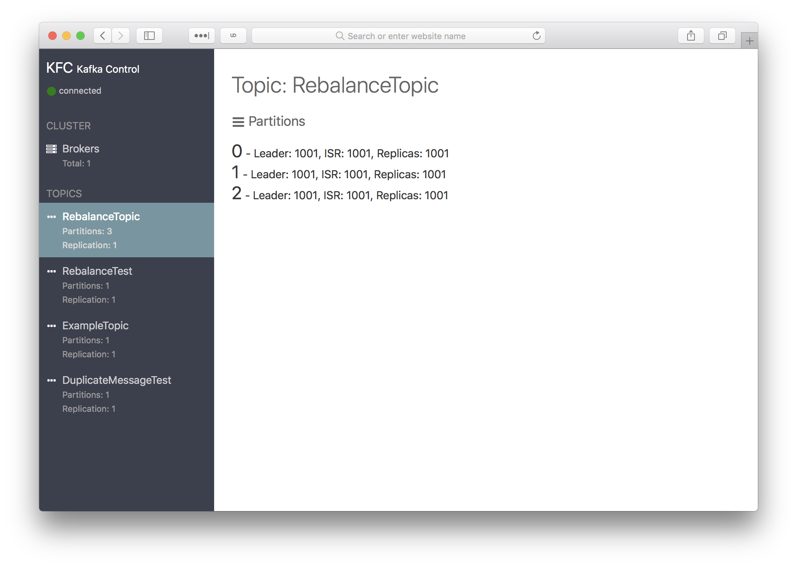

# kafka control (KFC)
[](https://travis-ci.org/jlandersen/kafka-control)

A web based UI for interacting with Kafka clusters. Works with Kafka clusters running 0.10 and above.

## How to run
KFC is provided as a Docker image ([jlandersen/kfc](https://hub.docker.com/r/jlandersen/kfc/)) - run it using:
```
docker run -p 8000:80 --init jlandersen/kfc:latest
```

KFC is not tied to a specific cluster, so you can easily reuse a running instance between multiple Kafka clusters. 

Once the container is running, access a specific cluster by providing the `brokers` query parameter. Example:
```
my-host:8000?brokers=broker01:9092
```

Brokers can either be a single broker or a comma-separated list of brokers (ZooKeeper endpoints are not valid).

## Planned Features
* Create/delete topics (with configurations)
* Reconfigure topics
* Consuming/Producing

## Screenshots
